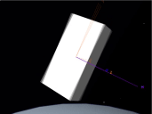

# freebody
A class for simulating torque-free motion with high-precision


## Usage
```lua
local my_body = freebody.new()--Instantiate the object

my_body:set_shape(mat3.new(2, 0, 0, 0, 1, 0, 0, 0, 4), 0.3)--2x1x4 cuboid with 0.3 density
my_body:set_omega(vec3.new(4, 0.01, -0.02))--Spin it!

on_step:connect(function(dt)--Main loop
	my_body:step(dt, 6)--Step the freebody with 8 rotational derivative terms (More terms, better accuracy)
end)

```